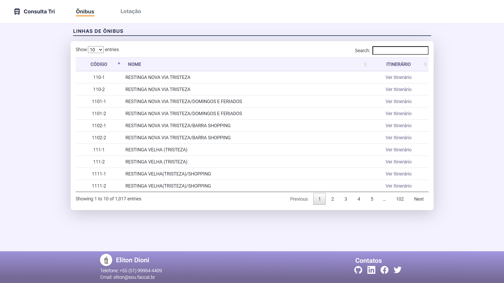
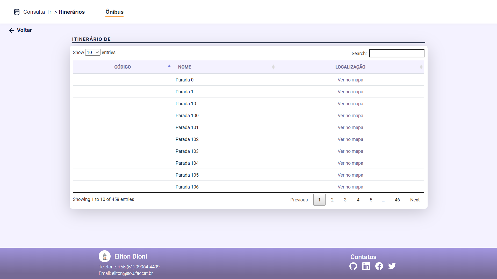

<h4 align="center">
  <b>🚍 Sistema de consultas DataPOA 🚌</b>
</h4>

<p align="center">
  <a href="#-projeto">Projeto</a> |
  <a href="#-tecnologias">Tecnologias</a> |
  <a href="#-screenshots">Screenshots</a> |
  <a href="#-instalação">Instalação</a>   |
</p>

<br>

### 🚐 Projeto

O projeto tem como finalidade realizar consultas de linhas de ônibus e linhas de lotação integrado ao DataPOA, podendo visualizar os itinerários através do Google Maps.

### 👨‍💻 Tecnologias  

Consulta Tri foi desenvolvido a partir das tecnologias:

* [Angular](https://angular.io/)
* [Angular Material](https://material.angular.io/)
* [Bootstrap](https://getbootstrap.com/)
* [Datatable](https://datatables.net/)

### 📸 Screenshots

##### Tela de Linhas de Ônibus e Lotação



##### Tela de Itinerários



### 💾 Instalação

Clone este repositório:

```bash
git clone https://github.com/Eliton-Dioni/consulta-tri.git
```

Entre na pasta do projeto:

```bash
cd consulta-tri/
```

Para instalar todas as depêndencias, execute o comando:

```bash
npm install
```

Para rodar a aplicação Angular, dentro do diretório `consulta-tri`, execute um dos comandos:

```bash
ng serve ou npm start
```

Navegue até `http://localhost:4200/` em um navegador de sua preferência.

### ♻️ Contribuição

Sempre podemos nos aperfeiçoar, me ajude a criar um repositório cada vez melhor!

* Faça um fork desse repositório via Github;
* Crie uma branch com a sua feature: `git checkout -b my-feature-example`
* Faça commit das suas mudanças: `git commit -m 'feat: My new feature example'`
* Dê Push na sua branch: `git push origin my-feature-example`

### 📝 Licença

Esse projeto está sob a licença MIT. Veja o arquivo [LICENSE](./LICENSE) para mais detalhes.

</br>

Criado com ❤️ e ☕ por Eliton Dioni [LinkedIn](https://www.linkedin.com/in/eliton-dioni-9628a0104/)
